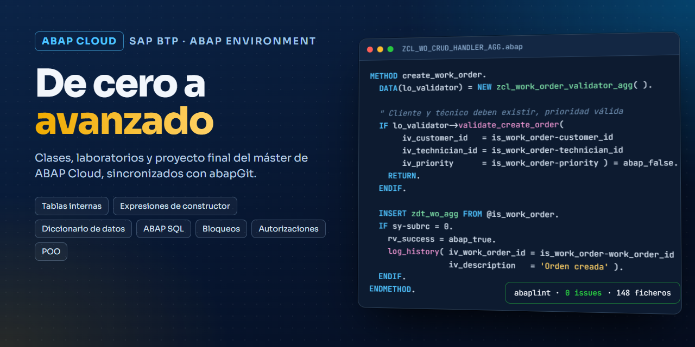
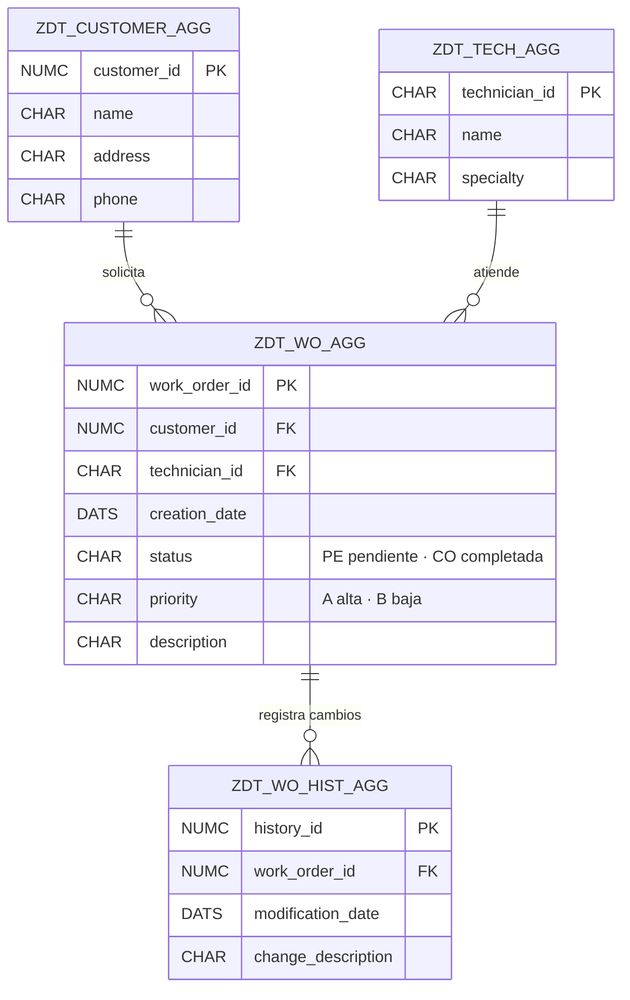

<div align="center">



# SAP ABAP Cloud · De cero a avanzado

Clases, ejercicios y proyecto final del **máster de SAP ABAP Cloud**, desarrollados en **SAP BTP (ABAP Environment)** con Eclipse ADT y sincronizados con GitHub mediante **abapGit**.

[](https://github.com/abelg02/ABAP_Cloud_CA/actions/workflows/abaplint.yml)


Segunda parte: [ABAP Cloud · de avanzado a experto](https://github.com/abelg02/ABAP_Cloud_AE)

</div>

---

## Contenido

| Bloque | Temario | Qué hay en el repositorio |
| --- | --- | --- |
| [Primeros pasos](src) | Clases de introducción sobre el modelo de vuelos `/DMO/` de SAP | Clases locales, atributos, métodos funcionales y excepciones |
| [01](src/zabap_abel_c01) | Herramientas y conceptos básicos | Estructura de clases y laboratorio de variables |
| [02](src/zabap_abel_c02) | Operaciones, textos y cadenas de caracteres | Aritmética (y sus formas obsoletas), redondeo y truncamiento, fechas del sistema, `OVERLAY`, `SUBSTRING`, `FIND`, `REPLACE`, `SPLIT`… Laboratorio de **gestión de facturas** |
| [03](src/zabap_abel_c03) | Bifurcaciones, estructuras y tipos locales | Operadores lógicos y su prioridad, `IF`, `CASE`, `SWITCH`, `COND`, bucles `DO`, `WHILE` y `LOOP`, `CHECK`, `TRY`-`CATCH`. Laboratorio de **estructuras de control** |
| [04](src/zabap_abel_c04) | Tablas internas | Tablas `STANDARD`, `SORTED` y `HASHED`, `VALUE #`, `APPEND`, `INSERT`, `MODIFY`, `DELETE`, `COLLECT`, `SORT`, `CORRESPONDING` con `BASE` y `MAPPING` |
| [05](src/zabap_abel_c05) | Expresiones de constructor y punteros | Estructura de clases del bloque |
| [06](src/zabap_abel_c06) | Depuración, programación dinámica y rendimiento | Estructura de clases del bloque |
| [07-08](src/zabap_abel_c07_c08) | Diccionario: tipos, tablas, bloqueos y relaciones | **Dominios, elementos de datos, estructura, tipo tabla y objeto de bloqueo** |
| [09-10](src/zabap_abel_c09_c10) | Programación ABAP SQL | Estructura de clases (consultas, joins, subconsultas, commit/rollback) |
| [11](src/zabap_abel_c11) | ABAP SQL push-down | Estructura de clases del bloque |
| [12](src/zabap_abel_c12) | ATC y abapGit | **Objeto de autorización** con su campo |
| [Proyecto final](src/zabap_wo_agg) | Gestión de órdenes de trabajo | Modelo de datos completo, CRUD, validaciones, historial, autorizaciones y pruebas (ver abajo) |

> En los bloques 05, 06, 09-10 y 11 el repositorio solo conserva la estructura de las clases.

## Proyecto final: gestión de órdenes de trabajo

Sistema para registrar órdenes de trabajo de clientes, asignarlas a técnicos y llevar un historial de cambios.



- **Diccionario de datos propio**: 7 dominios (estado, prioridad y actividad con valores fijos), 16 elementos de datos y 4 tablas con claves foráneas.
- **[`ZCL_WO_CRUD_HANDLER_AGG`](src/zabap_wo_agg/zcl_wo_crud_handler_agg.clas.abap)**: crear, leer, actualizar (solo los campos que cambian) y eliminar órdenes. Cada cambio queda en el historial.
- **[`ZCL_WORK_ORDER_VALIDATOR_AGG`](src/zabap_wo_agg/zcl_work_order_validator_agg.clas.abap)**: reglas de negocio.
  - El cliente y el técnico tienen que existir.
  - La prioridad y el estado deben tener valores permitidos.
  - Solo se pueden modificar o borrar las órdenes pendientes.
- **Autorizaciones**: objeto `ZAC_WO_AGG` con los campos `Z_ACTVT` (crear, cambiar, ver, borrar) y `Z_STATUS`, comprobado con `AUTHORITY-CHECK`. En el entorno de pruebas la comprobación está desactivada (comentada en el código).
- **[`ZCL_WORK_ORDER_CRUD_TEST_AGG`](src/zabap_wo_agg/zcl_work_order_crud_test_agg.clas.abap)**: prepara datos de prueba y ejecuta las cuatro operaciones desde la consola de Eclipse.

```abap
" Actualización parcial: solo se aplican los campos que llegan informados
IF lo_validator->validate_update_order( iv_work_order_id = iv_work_order_id
                                        iv_status        = ls_current-status ) = abap_false.
  RETURN.  " Solo las órdenes pendientes ('PE') se pueden modificar
ENDIF.

IF is_changes-priority IS NOT INITIAL.
  ls_current-priority = is_changes-priority.
ENDIF.
...
UPDATE zdt_wo_agg FROM @ls_current.
IF sy-subrc = 0.
  log_history( iv_work_order_id = iv_work_order_id
               iv_description   = 'Orden actualizada' ).
ENDIF.
```

## Algunos ejemplos del curso

```abap
" Expresiones condicionales (bloque 03)
DATA(lv_descuento) = COND #( WHEN lv_monto >= 1000 THEN '10% de descuento'
                             WHEN lv_monto >= 500  THEN '5% de descuento'
                             ELSE 'Sin descuento' ).

" Copiar entre tablas internas con campos de distinto nombre (bloque 04)
gt_flights_renamed = CORRESPONDING #( gt_flights MAPPING carrier    = carrier_id
                                                         connection = connection_id
                                                         date       = flight_date ).
```

## Calidad del código

Todo el código se analiza automáticamente con **[abaplint](https://abaplint.org)** en cada cambio. Se compara con la API pública de SAP BTP para detectar:
- errores de sintaxis,
- tipos desconocidos,
- incoherencias del diccionario,
- SQL no válido en ABAP Cloud,
- sentencias obsoletas.

La configuración está en [`abaplint.json`](abaplint.json).

## Cómo usarlo

El código ABAP se ejecuta dentro de un sistema SAP, así que no hay una demo web. Para importarlo:

1. Abre un sistema **SAP BTP ABAP Environment**. Sirve la cuenta de prueba gratuita (*trial*).
2. En **Eclipse con ABAP Development Tools**, instala el plugin de **abapGit**.
3. Crea un paquete, enlaza este repositorio y haz **Pull**.
4. Ejecuta cualquier clase con **F9**: todas implementan `IF_OO_ADT_CLASSRUN` y escriben el resultado en la consola.
